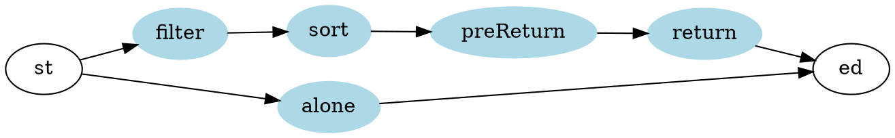

[](https://travis-ci.com/104corp/searchMaskNearby)

# Console Version Mask Map in Taiwan

## Install Relation Library
```shell
composer install
```
## Usage
### Run the program
```shell
php mask.php
```
### Search by count
```shell
# -a, --adult to search count of adult mask
# -c, --child to search count of child mask
# -s, --sum   to search count of mask sum
php mask.php -a 100         # adult mask >= 100
php mask.php -c 120,300     # 120 <= child mask <= 300
php mask.php -sum 456,777   # 456 <= mask sum <= 777
```
### Search by address or institution
```shell
# -i, -institution to search keyword in institution name
# -d, -address.    to search keyword in address
php mask.php -institution 衛生所  # institution name contain 衛生所
php mask.php -d 臺北,大安         # address contain 臺北 and 大安
```
### Sort Result
```shell
# --sort         to sort in decrease
# --sortDecrease to sort in decrease
# --sortIncrease to sort in increase
php mask.php --sortDecrease a     # sort decrease with adult field
php mask.php --sortIncrease s,c   # sort increase with sum and child
php mask.php --sort i,d           # sort decrease with inst. and address 
```
### Result Limit
* default return limit is 30
```shell
php mask.php --returnLimit 20     # restruic return result in 20
```
### Teams and google api
```shell
php mask.php --setTeamsToken      # easy to set teams token
php mask.php --sendToTeams        # send a copy to teams
php mask.php --setGoogleApiKey    # easy to set googleapi
php mask.php --appendGoogleApi    # add google info to result
```
### help
```shell
php mask.php --help               # show all commant that can be used
```
## Development Decoument
### Environment
* php
* composer
### Parameter Parsing Restrict
|指令 (key)/<br>參數鍵|參數值<br>格式|參數值<br>限制|允許值 (val)|類別|
|-|-|-|-|-|
|d<br>address|m,n,...|1-5|(string)|filter|
|i<br>institution|m,n,...|1-5|(string)|filter|
|a<br>adult|m \| m,n|1-2| (int)|filter|
|c<br>child|m \| m,n|1-2| (int)|filter|
|s<br>sum|m \| m,n|1-2| (int)|filter|
sort|m,n,...|0-5|"adult", "a", <br>"child", "c", <br>"sum", "s", <br>"address", "d", <br>"institution", "i"|sort|
|sortDecrease|m,n,...|0-5|同上|sort|
|sortIncrease|m,n,...|0-5|同上|sort|
|returnLimit|m|1|(int)1-30|preReturn|
|setTeamsToken|m|1|(string)|alone|
|sendToTeams|null|0|true|return|
|setGoogleApiKey|m|1|(string)|alone|
|appendGoogleApi|null|0|true|return
|h<br>help|null|0|true|alone|

### Parameter parsing should rearrange the order as follow:
